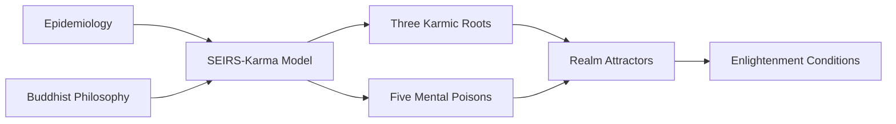

# Mathematical Modeling of Karmic Dynamics

[](https://mybinder.org/v2/gh/eduwardus/karma-dynamics/main)
[](https://colab.research.google.com/github/eduwardus/karma-dynamics)
[](https://doi.org/10.5281/zenodo.15615660)

Official computational implementation for the paper:  
**"Mathematical Modeling of Karmic Dynamics: An Epidemiological Approach to Buddhist Philosophy"**

## Overview
This repository bridges complex systems theory and contemplative traditions through:
- **Epidemiological-Karmic Synthesis**: Adaptation of SEIRS models to Buddhist philosophy
- **Wisdom Quantification**: Parameterization of spiritual development (w)
- **Nonlinear Dynamics**: Modeling of Three Karmic Roots and Five Mental Poisons
- **Attractor Theory**: Samsara realms as distinct dynamical regimes
- **Social Physics**: Network extensions for collective karma



## Models

| Model | Script | Key Features | Mathematical Representation |
|-------|--------|--------------|-----------------------------|
| **Individual Karma** | [seirs_karma.py](scripts/seirs_karma.py) | SEIRS-Karma framework with wisdom modulation | `dS/dt = ξ(1-w)R - αS + λf(R)` |
| **Three Roots** | [three_roots.py](scripts/three_roots.py) | Ignorance-Attachment-Aversion coupling | `dI/dt = α_I I + β_IA AV - γ_I w I` |
| **Five Poisons** | [five_poisons.py](scripts/five_poisons.py) | Asymmetric interactions with pride/envy extensions | `dP/dt = α_P P + β_PA PA - γ_P w P` |
| **Samsara Realms** | [realms_attractors.py](scripts/realms_attractors.py) | Realm-specific attractor configurations | 6 dynamical regimes (Table 1) |
| **Enlightenment** | [enlightenment.py](scripts/enlightenment.py) | Lyapunov-stable fixed point at K=0 | `w > max( (α_i + 0.5Σ|β_ij|)/γ_i )` |
| **Stochastic Extensions** | [stochastic_extensions.py](scripts/stochastic_extensions.py) | Randomness & time delays in karmic processes | `dE = [α_E E + ...]dt + σ_E E dW_t` |
| **Collective Karma Network** | [network_karma.py](scripts/network_karma.py) | Social influence on karmic dynamics | `dw_i/dt = ε(1-w_i) - μ w_i + ΣA_{ij}(w_j - w_i)` |
## Key Parameter Documentation
Each model contains adjustable parameters that control its behavior. Below are the main parameters for all simulation scripts:
### 1. Individual Karma SEIRS Model (`seirs_karma.py`)
| Parameter | Description | Typical Range | Unit | Equation |
|-----------|-------------|--------------|------|----------|
| `alpha` | Latent karma activation rate | [0.1, 0.5] | 1/time | `dS/dt = ... - αS` |
| `sigma` | Intention manifestation rate | [0.2, 0.6] | 1/time | `dE/dt = αS - σE` |
| `gamma` | Action resolution rate | [0.3, 0.7] | 1/time | `dI/dt = σE - γI` |
| `xi` | Karmic residue recycling rate | [0.1, 0.4] | 1/time | `dS/dt = ξ(1-w)R - ...` |
| `w` | Wisdom factor | [0, 1] | dimensionless | Modulates relapse |
| `lambda_val` | Maximum habit feedback rate | [0.05, 0.2] | 1/time | `+ λ·R/(1+R)` |

### 2. Three Karmic Roots Model (`three_roots.py`)
| Parameter | Description | Typical Range | Unit | Equation |
|-----------|-------------|--------------|------|----------|
| `alpha_I` | Ignorance (I) auto-reinforcement | [0.1, 0.5] | 1/time | `dI/dt = α_I I + ...` |
| `alpha_A` | Attachment (A) auto-reinforcement | [0.1, 0.5] | 1/time | `dA/dt = α_A A + ...` |
| `alpha_V` | Aversion (V) auto-reinforcement | [0.1, 0.5] | 1/time | `dV/dt = α_V V + ...` |
| `beta_IA` | Attachment+Aversion → Ignorance | [0.2, 0.8] | 1/time | `β_IA A V` |
| `beta_AV` | Aversion+Ignorance → Attachment | [0.2, 0.8] | 1/time | `β_AV V I` |
| `beta_VI` | Ignorance+Attachment → Aversion | [0.2, 0.8] | 1/time | `β_VI I A` |
| `gamma_I` | Wisdom sensitivity (Ignorance) | [0.3, 0.7] | dimensionless | `- γ_I w I` |
| `gamma_A` | Wisdom sensitivity (Attachment) | [0.3, 0.7] | dimensionless | `- γ_A w A` |
| `gamma_V` | Wisdom sensitivity (Aversion) | [0.3, 0.7] | dimensionless | `- γ_V w V` |
| `w` | Wisdom factor | [0, 1] | dimensionless | Global damping |

### 3. Five Mental Poisons Model (`five_poisons.py`)
| Parameter | Description | Typical Range | Unit | Notes |
|-----------|-------------|--------------|------|-------|
| `alpha_X` | Auto-reinforcement rate | [0.1, 0.5] | 1/time | X ∈ {I, A, V, P, E} |
| `beta_XY` | Asymmetric coupling | [0.05, 0.8] | 1/time | Doctrinal hierarchy (β_ij ≠ β_ji) |
| `gamma_X` | Wisdom sensitivity | [0.3, 0.7] | dimensionless | Poison-specific |
| `w` | Wisdom factor | [0, 1] | dimensionless | Global control |

### 4. Samsara Realms Attractors (`realms_attractors.py`)
| Parameter | Description | Realm-Specific Values | Notes |
|-----------|-------------|------------------------|-------|
| `alpha_X` | Auto-reinforcement | Varies by realm | Higher in Naraka, lower in Devas |
| `beta_XY` | Cross-coupling | Varies by realm | Strong in Humans, weak in Animals |
| `gamma_X` | Wisdom sensitivity | Varies by realm | Higher in Devas |
| `w` | Wisdom level | [0.01 (Naraka) - 0.45 (Devas)] | Dimensionless |
| `y0` | Initial condition | Poison-predominant setup | Eg: Devas → High Attachment |

### 5. Enlightenment Analysis (`enlightenment.py`)
| Parameter | Description | Range | Key Equation |
|-----------|-------------|-------|--------------|
| `w_critical` | Minimum wisdom threshold | >0 | `max_i((α_i + 0.5Σ|β_ij|)/γ_i)` |
| `recovery_threshold` | Convergence tolerance | [0.01, 0.1] | 10% of perturbation |
| `tolerance` | Enlightenment precision | 1e-3 | `||K|| < tolerance` |

### 6. Stochastic Extensions (`stochastic_extensions.py`)
| Parameter | Description | Typical Range | Unit |
|-----------|-------------|--------------|------|
| `sigma_X` | Noise intensity (X=S,E,I,R) | [0.01, 0.1] | dimensionless |
| `tau` | Karmic maturation delay | [5, 20] | time |
| `perturbation` | (time, intensity, variable) | - | Tuple specification |
| `recovery_threshold` | Resilience threshold | [0.05, 0.2] | dimensionless |

### 7. Collective Karma Network (`network_karma.py`)
| Parameter | Description | Typical Range | Unit |
|-----------|-------------|--------------|------|
| `kappa_X` | Social influence strength | [0.01, 0.1] | 1/time |
| `epsilon` | Intrinsic wisdom growth | [0.05, 0.2] | 1/time |
| `mu` | Wisdom degradation | [0.01, 0.1] | 1/time |
| `delta` | Wisdom diffusion strength | [0.1, 0.5] | dimensionless |
| `w_critical` | Collective wisdom threshold | [0.5, 0.6] | dimensionless |## Installation


## Installation
```bash
git clone https://github.com/eduwardus/karma-dynamics.git
cd karma-dynamics
pip install -r requirements.txt

# Additional dependencies for specific models:
pip install sdeint ddeint networkx  # For stochastic_extensions.py and network_karma.py
```

## Usage
```python
# Run individual karma simulation
python scripts/seirs_karma.py

# Simulate three karmic roots dynamics
python scripts/three_roots.py

# Explore five mental poisons with asymmetric coupling
python scripts/five_poisons.py

etc...
```

## Philosophical Framework
> "Models are upāya (skillful means), not ultimate truth"  
> - Ethical Position: Middle Way (madhyamaka) non-reductionism  
> - Variables as normalized energy densities (bīja → vipāka)  
> - Conservation: "Karma transforms but is never destroyed"

### Abstract
> "This work presents a novel mathematical reinterpretation of epidemiological models for karmic dynamics... bridging complex systems theory and contemplative traditions while providing formal tools for analyzing social information networks of mental habit transmission."

## Citation
```bibtex
@article{gonzalezgranda2025karmic,
  title={Mathematical Modeling of Karmic Dynamics: An Epidemiological Approach to Buddhist Philosophy},
  author={Gonz{\'a}lez-Granda, Eduardo},
  journal={Preprint},
  year={2025},
  url={https://github.com/eduwardus/karma-dynamics}
}
```

## License
Apache 2.0 - See [LICENSE](LICENSE)
