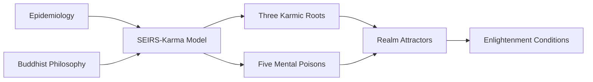

# Mathematical Modeling of Karmic Dynamics

[](https://mybinder.org/v2/gh/tu-usuario/karma-dynamics/main)
[](https://colab.research.google.com/github/tu-usuario/karma-dynamics)
[](https://doi.org/10.5281/zenodo.15615660)

Official computational implementation for the paper:  
**"Mathematical Modeling of Karmic Dynamics: An Epidemiological Approach to Buddhist Philosophy"**

## Overview
This repository bridges complex systems theory and contemplative traditions through:
- **Epidemiological-Karmic Synthesis**: Adaptation of SEIRS models to Buddhist philosophy
- **Wisdom Quantification**: Parameterization of spiritual development (w)
- **Nonlinear Dynamics**: Modeling of Three Karmic Roots and Five Mental Poisons
- **Attractor Theory**: Samsara realms as distinct dynamical regimes
- **Social Physics**: Network extensions for collective karma



## Models
| Model | Script | Key Equations |
|-------|--------|--------------|
| Individual Karma | [seirs_karma.py](scripts/seirs_karma.py) | `dS/dt = ξ(1-w)R - αS + λ·R/(1+R)` |
| Three Karmic Roots | [three_roots.py](scripts/three_roots.py) | `dI/dt = α_I I + β_IA AV - γ_I w I` |
| Five Mental Poisons | [five_poisons.py](scripts/five_poisons.py) | `dP/dt = α_P P + β_PA PA - γ_P w P` |
| Samsara Realms | [realms_attractors.py](scripts/realms_attractors.py) | 6 Attractor configurations |
| Enlightenment | [enlightenment.py](scripts/enlightenment.py) | `w > max_i((α_i + 0.5Σ|β_ij|)/γ_i)` |
## Key Parameter Documentation

Each model contains adjustable parameters that control its behavior. Below are the main parameters for all simulation scripts:

<details>
<summary><b>Individual Karma SEIRS Model</b> (seirs_karma.py)</summary>

| Parameter | Description | Typical Range | Unit | Equation |
|-----------|-------------|--------------|------|----------|
| `alpha` | Latent karma activation rate | [0.1, 0.5] | 1/time | `dS/dt = ... - αS` |
| ... | ... | ... | ... | ... |

</details>

<details>
<summary><b>Three Karmic Roots Model</b> (three_roots.py)</summary>

| Parameter | Description | Typical Range | Unit | Equation |
|-----------|-------------|--------------|------|----------|
| `alpha_I` | Ignorance auto-reinforcement | [0.1, 0.5] | 1/time | `dI/dt = α_I I + ...` |
| ... | ... | ... | ... | ... |

</details>

... (repeat for each model)
## Installation
```bash
git clone https://github.com/tu-usuario/karma-dynamics.git
cd karma-dynamics
pip install -r requirements.txt
```

## Usage
```python
# Run individual karma simulation
python scripts/seirs_karma.py

# Simulate three karmic roots dynamics
python scripts/three_roots.py

# Explore five mental poisons with asymmetric coupling
python scripts/five_poisons.py
```

## Philosophical Framework
> "Models are upāya (skillful means), not ultimate truth"  
> - Ethical Position: Middle Way (madhyamaka) non-reductionism  
> - Variables as normalized energy densities (bīja → vipāka)  
> - Conservation: "Karma transforms but is never destroyed"

### Abstract
> "This work presents a novel mathematical reinterpretation of epidemiological models for karmic dynamics... bridging complex systems theory and contemplative traditions while providing formal tools for analyzing social information networks of mental habit transmission."

## Citation
```bibtex
@article{gonzalezgranda2024karmic,
  title={Mathematical Modeling of Karmic Dynamics: An Epidemiological Approach to Buddhist Philosophy},
  author={Gonz{\'a}lez-Granda, Eduardo},
  journal={Preprint},
  year={2024},
  url={https://github.com/tu-usuario/karma-dynamics}
}
```

## License
Apache 2.0 - See [LICENSE](LICENSE)
